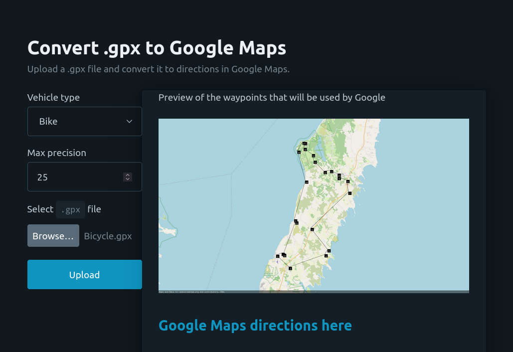

# Convert GPX to Google Maps directions

The website can be found here: https://www.convert-gpx-to-gmaps.com/

## What is this?

It's a small tool for converting .gpx files into Google Maps directions.

My personal use case (and the reason I built this) is taking rides/routes from Strava and converting them into Google Maps directions since I don't use Strava directly when riding and would prefer using Google Maps. It's a bit rough around the edges, but did the trick for me!
